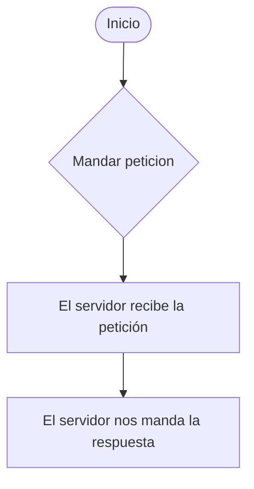

##  __Página web de Nike__
# 1. Parte A - Reconstrucción cliente/servidor

# 2. Parte B - Capacidades del navegador
En mi caso escogí las cookies que resuelve la persistencia de datos para mantener los productos en el carrito de compras, recordar sesiones  realizar seguimiento de cashback. Nos pone una notificación para aceptar o denegar el permiso, si se deniega se producen fallos técnicos como la pérdida de dicho carrito de compras, cierre sesión inmediato, etc. Y este mete riesgos de privacidad con el perfil sobre la publicidad. Como alternativa esta acceder desde la aplicación móvil. También usa LocalStorage para guardar archivos en el navegador local y también usa la geolocalización para buscar las tiendas cercanas.

# 3. Parte C - Lenguajes y Scripts
**Clasificación:**
Contenido conservado, acción perdida
Tiene una alternativa conservada para gran parte de archivos pero no para todos como ver diferentes imágenes de unas zapatillas concretas y se pierde la acción de añadir a la cesta, solo deja guardarlo en favorito.

# 4. Parte D - Marcas y programación

Por lo general veo el código muy bien estructurado y simplificado sin necesidad de más cambios, ya que usa también React y esta muy bien realizado el hecho de que elegir el tamaño de cada prenda use una etiqueta <button>, aunque solucionaría los errores de las etiquetas que dije anteriormente que no estaban bien cerradas o faltaban las comillas.

# 5. Parte E - Herramientas y prueba

1. observación manual con DevTools;  
Realiza correctamente los cambios de tamaño correctamente redimensionando automáticamente, se puede inspeccionar y realizar todas las acciones de devtools  

2. validación estática de HTML o CSS;  
Algunos errores de escritura en el código por no cerrar bien las etiquetas, propiedad <meta> y propiedades escritas sin comillas.  

3. recorrido funcional con resultado esperado;  
Actualiza correctamente el carrito de compra al agregar o reducir cantidades  

4. comprobación básica con teclado;  
Cumple con los criterios de accesibilidad  

6. simulación de red lenta o error, si la aplicación realiza peticiones.  
La simulación es rapida no tarda ni da error aunque lo ponga en 3G  
  

(Ahora si lo pongo ofline claramente me va a dar error que no se puede cargar la página por no tener conexión a internet).

