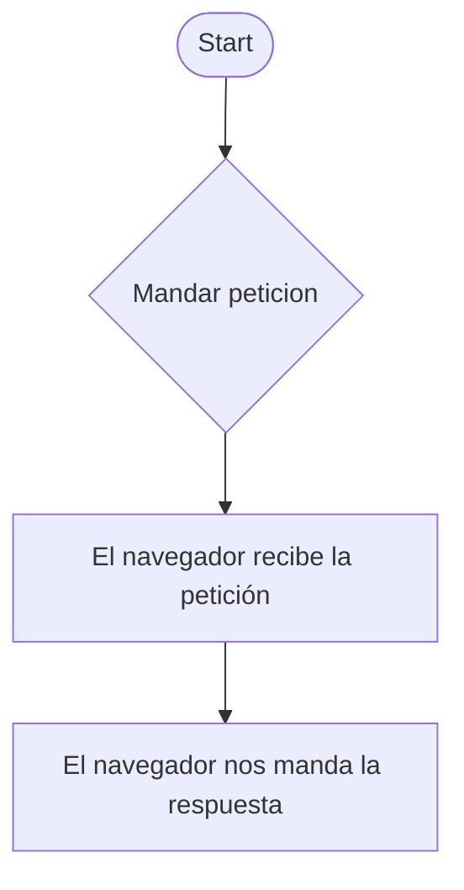

##  __Página web de Nike__
# 1. Parte A - Reconstrucción cliente/servidor

# 2. Parte B - Capacidades del navegador
En mi caso escogí las cookies que resuelve la persistencia de datos para mantener los productos en el carrito de compras, recordar sesiones  realizar seguimiento de cashback. Nos pone una notificación para aceptar o denegar el permiso, si se deniega se producen fallos técnicos como la pérdida de dicho carrito de compras, cierre sesión inmediato, etc. Y este mete riesgos de privacidad con el perfil sobre la publicidad. Como alternativa esta acceder desde la aplicación móvil.

# 3. Parte C - Lenguajes y Scripts

En este ejemplo podemos comprobar el html que hace uso de mains para crear como cuadros de su catálogo, también tenemos el css para dar diseño y el javascript para hacer cosas como puede ser seleccionar métodos de pago

# 4. Parte D - Marcas y programación

Por lo general veo el código muy bien estructurado y simplificado sin necesidad de más cambios, pero escribiria el código en español en vez de inglés para mayor facilidad para nike españa

# 5. Parte E - Herramientas y prueba
La simulación es rapida no tarda ni da error

